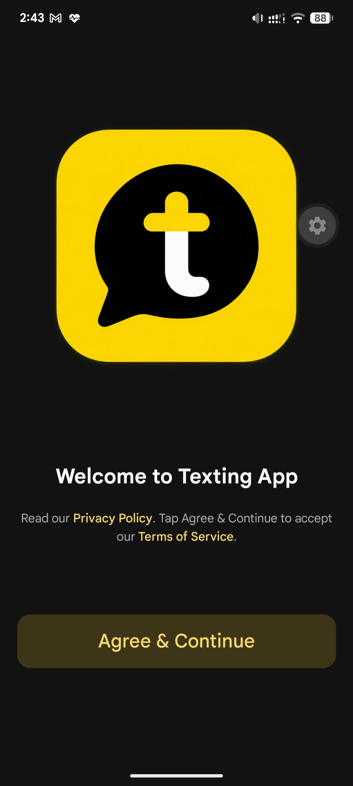
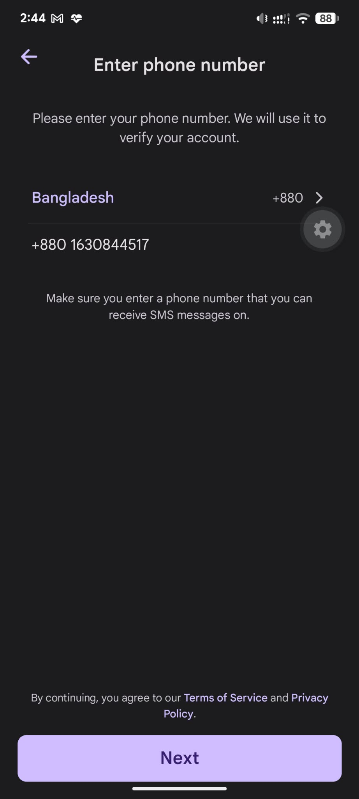
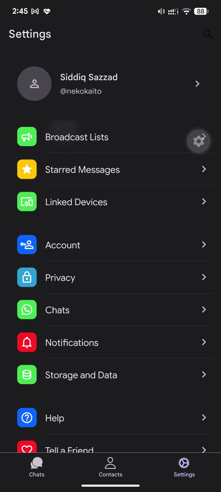
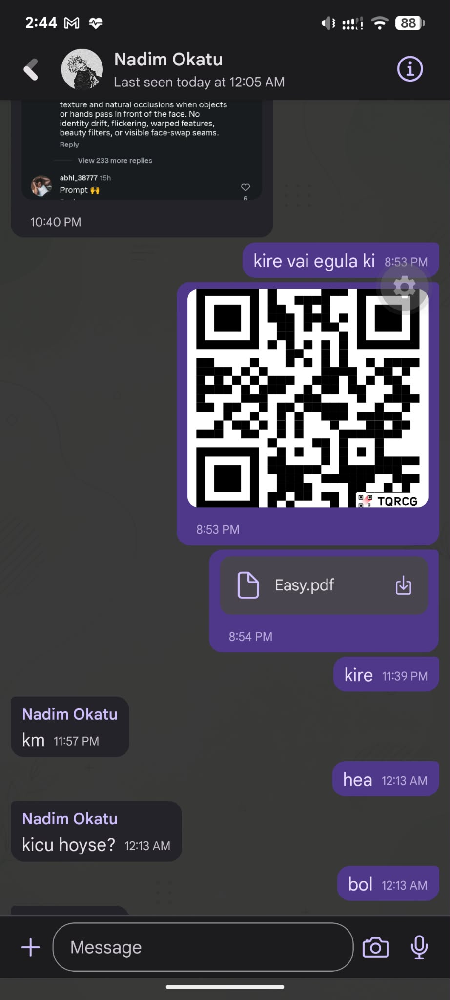

<h2 align="center"><u>Texting App</u></h2>

<p align="center">
    
</p>

<p align="center">
    
    
    
</p>

<p align="center">
    
    
    
    
    
</p>


# Texting

Texting is a real-time messaging application built with React Native and Expo. It provides phone-number authentication, real-time conversations, media sharing, notifications, user profiles, and dark mode.

## Features

- Phone number authentication
- OTP verification
- One-to-one real-time messaging
- Message delivery and read status
- Image sharing
- Chat notifications
- User profiles and profile pictures
- Dark mode support
- Secure session storage
- Real-time communication with Socket.IO

## App Preview

<p align="center">
  
  &nbsp;&nbsp;&nbsp;
  
  &nbsp;&nbsp;&nbsp;
  
  &nbsp;&nbsp;&nbsp;
  
</p>

## Tech Stack

### Mobile

- React Native
- Expo
- Expo Router
- React Native Paper
- Expo Secure Store
- Socket.IO Client

### Backend

- Node.js
- Socket.IO
- Oracle Database

## Installation

Clone the repository:

```bash
git clone <repository-url>
cd texting-app
```

Install dependencies:

```bash
npm install
```

Create a local environment file:

```env
EXPO_PUBLIC_API_URL=http://YOUR_SERVER_IP:5000
```

Start the Expo development server:

```bash
npx expo start
```

## Environment Variables

The mobile application uses:

```env
EXPO_PUBLIC_API_URL=http://YOUR_SERVER_IP:5000
```

The backend URL must be reachable from the Android device. For local development, the device and backend computer generally need to be on the same network.

For production, use an HTTPS backend URL instead of a private LAN address.

## Android Build

The project uses EAS Build.

Build a production Android App Bundle:

```bash
eas build --platform android --profile production
```

The resulting AAB can be uploaded to Google Play Console.

For direct Android testing, use an APK build or generate an APK from the AAB with bundletool.

## Development Release

The current development release is:

**Texting v1.0.0-dev**

The development APK is distributed through the GitHub Releases section.

This release is intended for testing and may depend on a development backend.

## Backend

The mobile application communicates with the Texting backend through the API configured by `EXPO_PUBLIC_API_URL`.

Real-time messaging uses Socket.IO.

The backend uses Oracle Database for persistent application data.

## Security

Do not commit credentials or signing material to the repository.

Keep these files private:

```text
.env
credentials.json
*.jks
*.keystore
```

Never publish database passwords, API secrets, JWT secrets, private signing keys, or other sensitive credentials.

## Android Application Identity

```text
Application name: Texting
Package ID: com.anonymous.textingapp
Version: 1.0.0
```

## Release History

### v1.0.0-dev

Initial development release containing:

- Phone authentication
- OTP verification
- Real-time messaging
- Message delivery and read status
- Image sharing
- Notifications
- User profiles
- Dark mode
- Secure session storage

See the GitHub Releases section for downloadable Android builds.

## Project Status

This project is currently in development. The development release is intended for testing and evaluation. Production deployment and public backend infrastructure may require additional configuration.


## Contributors


<a href="https://github.com/nekokaito/texting-app/graphs/contributors">
  
</a>


## License

Add the project's license information here.
